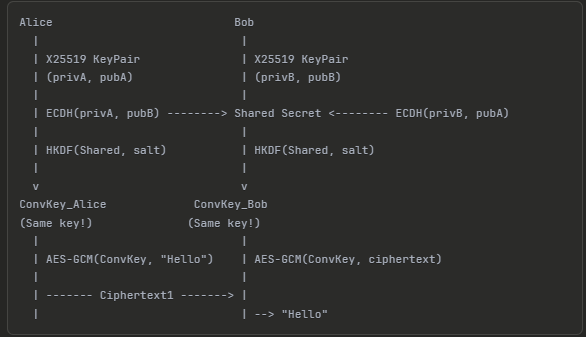

# 🔒 ReaNApp — Zero Trust Chat System (In Development)

ReaNApp is an experimental **Zero Trust chat platform** designed to push privacy beyond traditional end-to-end encryption.  
It introduces a **two-layer encryption model** where messages require both **E2EE** *and* a user-defined **PIN decryption key** for full access.

---

## 🧭 Vision

Modern chat apps claim to protect user data through end-to-end encryption.  
But if providers can decrypt messages for reporting, moderation, or “metadata analysis,” can we still call it *Zero Trust*?

ReaNApp explores an alternative:  
a communication system where **no central server** — not even the developer — can access message content or metadata.

---
## 🧱 Architecture Overview

ReaNApp uses a layered encryption architecture based on X25519 and AES-GCM,  
ensuring both parties derive the same session key through ECDH and HKDF before message encryption.

  

In ReaNApp’s “Maximum Security Mode,” this shared key is further wrapped with a local PIN-derived key before decryption.

---

## 🖼️ User Interface Preview

The app follows a dark cyber-aesthetic inspired by Zero Trust design —  
focused, minimal, and privacy-driven.

  

---

## ⚙️ Key Concepts

- **Dual Encryption:**  
  Layer 1 – E2EE (Curve / AES hybrid)  
  Layer 2 – Local PIN-based decryption

- **Ephemeral Storage:**  
  Messages self-erase after ≤ 10 seconds in maximum-security mode.

- **No Metadata Collection:**  
  No timestamps, IP logs, or tracking identifiers.

- **Panic Mode:**  
  Immediate full wipe of local caches and session keys.

---

## 🚧 Current Status

> ReaNApp is **under early development** — UI, encryption flow, and secure message caching are being tested.  
> The repository will evolve into a full Flutter prototype with modular encryption services.

---

## 🌱 Philosophy

> Privacy is not a feature.  
> It’s the foundation.

ReaNApp aims to demonstrate that real security is possible only when **trust is mathematically unnecessary**.

---

## 🧠 Author

**Mohammed Altanib**  
Cyber Security Student | Researcher | Developer  
[🌐 Portfolio Website](https://mohammedaltanib.com) • [🔗 LinkedIn](https://www.linkedin.com/in/mohammed-altanib-020a672a4/)

---

## ⚠️ Disclaimer

This project is an **academic and exploratory prototype**.  
It should not yet be used for production or sensitive communications.
